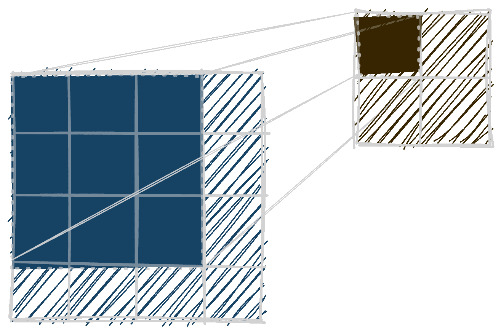
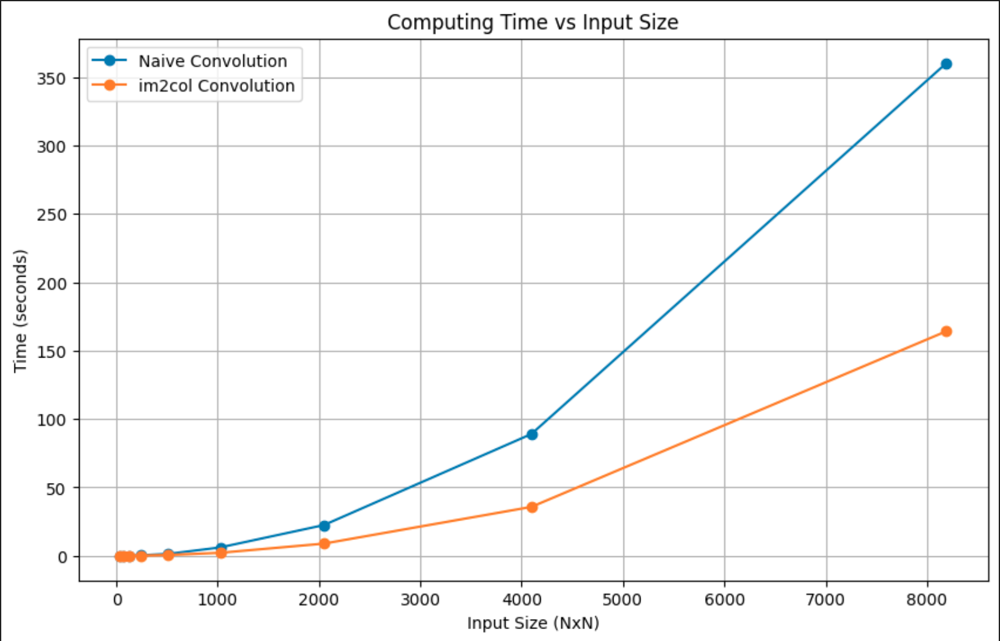
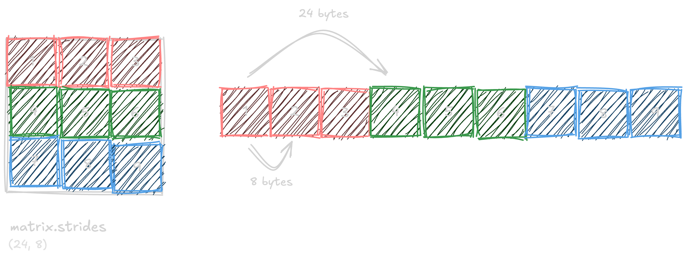
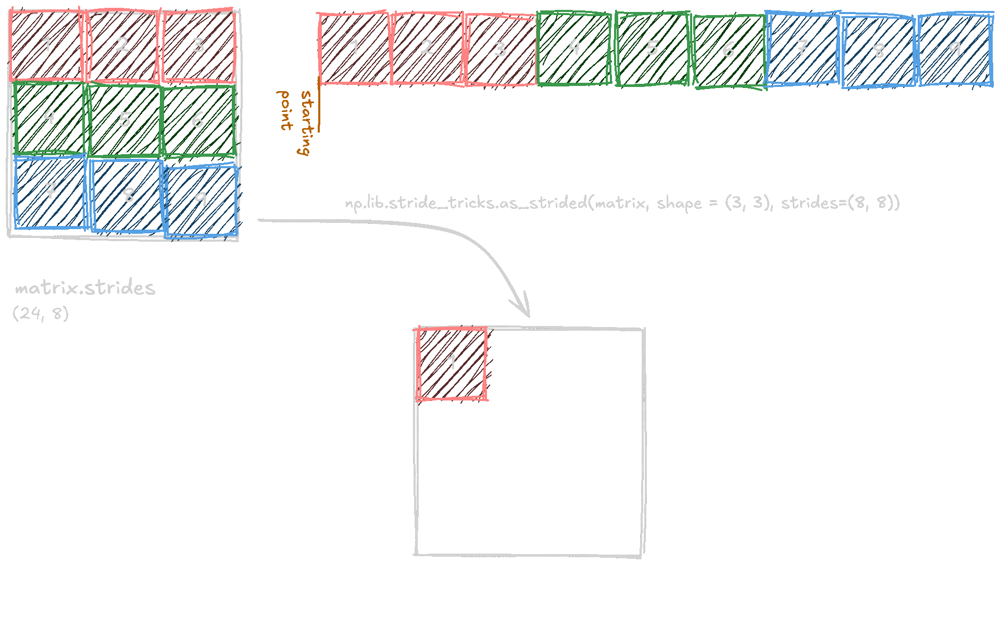
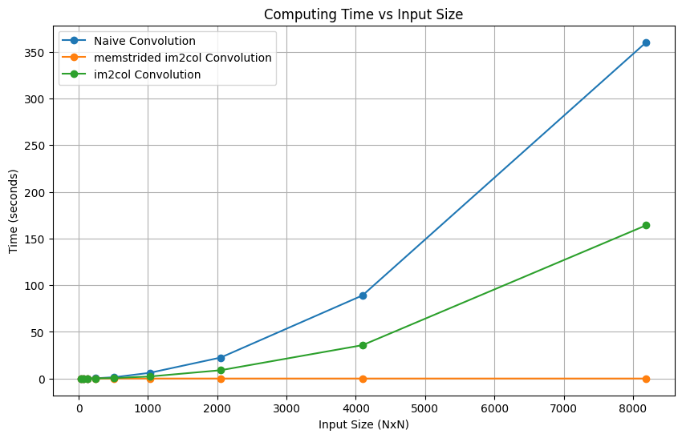
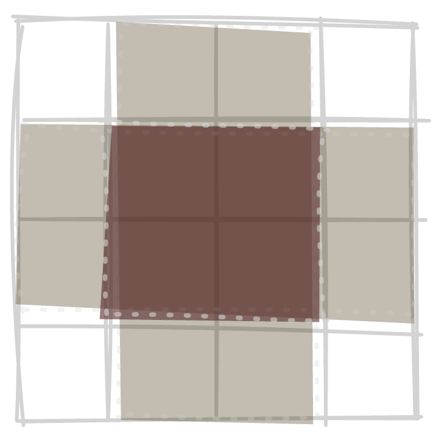
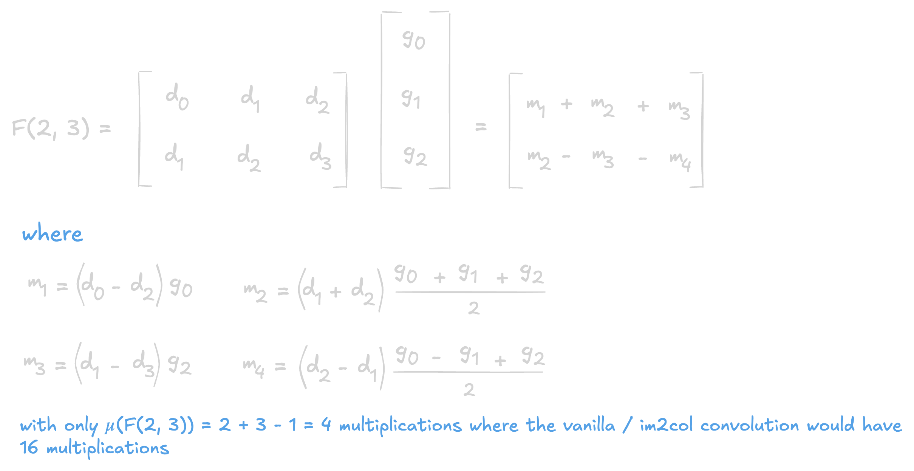
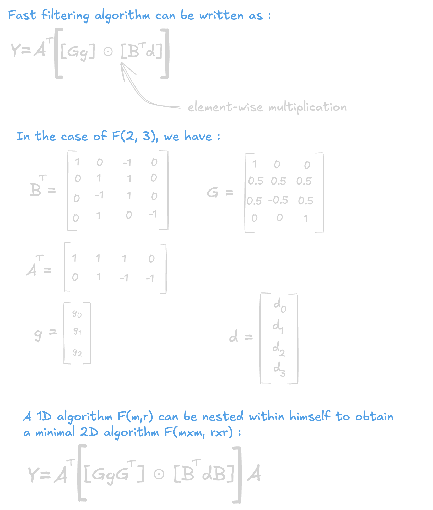

<div style="text-align:center">
  
</div>


## An important operation
Convolution is one of the most important linear operation in the domain of Deep Learning. It allowed the current state of Deep Learning by being at the center of one of the two major recent breakthrough (the other one being in 2017 with the attention mechanism[ [10] ](#10)). In 2012 when Krizhevsky et al.[ [9] ](#9) proved that state-of-the-art image modeling was overperformed by a CNN and a 100x larger dataset.


With almost 95% on the GPU computing time being spent on the convolution layer [ [8] ](#8), even by using GEMM computation[ [12] ](#12), it was necessary to find an algorithm capable of computing the convolution operation faster with small 3x3 kernels (state of the art).

## What are "fast" convolution algorithms ?
They are implementation of convolution algorithm that applies **algorithmic strength reduction** : the number of strong operations such as multplication [ [11] ](#11) is reduced at the expense of the increase of "weak" operations such as additions.

## Im2col
The im2col algorithm is not one the the fast algorithm I talked about just above since it performs the same number of multiplications as the direct naive convolution with nested loops.  But why do we talk about it then ? On most of textbook or tutorials, convolution is presented by a kernel window gliding on the input and computing the convolution operation at each spot.



And the naive implementation is some nested loops, not very efficient. The main idea of the im2col algorithm is to transform the whole process into a matrix multiplication so that we can exploit GEMM computation.
So do achieve this, let's say we work with a 3 channel w\*w input matrix and a 3 channel k\*k kernel, so that we obtain a mono channel (w-k+1)\*(w-k+1) feature map (no padding, no striding, no dilation, vanilla conv). We will then take every sliding window on the input matrix, convert it into a column, assembling those columns into a (k\*k\*c) \* ((h-k+1) \* (w-k+1)) matrix.

  The kernel is then also flattened, we execute a matrix multiplication and reshape the obtained result in a (h-k+1)\*(w-k+1) matrix with col2im. 
  
A naive way to implement it would be like this : 
```python
def im2col(input: np.array, k_h: int, k_w:int, stride: Tuple[int, int] = (1, 1)) -> np.array:
	input = np.atleast_3d(input)
	h, w, c = input.shape
	new_h = (h - k_h) // stride[0] + 1
	new_w = (w - k_w) // stride[1] + 1
	res = np.zeros((new_w*new_h, k_h*k_w*c))
	for j in range(new_h):
		for i in range(new_w):
			temp = input[j*stride[0]:j*stride[0]+k_h,i*stride[1]:i*stride[1]+k_w, :]
			res[j*new_w+i,:] = np.reshape(temp, -1)
	return new_h, new_w, res
```

Where it returns the transpose of the intermediary matrix, you just have to flatten the kernel, effectue a matmul and reshape the result in the desired format. So you might think that the huge data duplication would be memory expensive and you are right, but this is far overweighted by the fast computing of matrix-multiplication.


*Performances tested on a Apple M1 2020*

### Contiguous data
As seen previously, we need to create a col matrix in the process by using a for loop. But numpy as a very interesting function in our case that will drasticly decrease our computing time by using memory addresses to create our im2col matrix :  `np.lib.stride_tricks.as_strided()` . But first, we need to briefly check how an array is stocked  in memory.

An array  will have is values stored as an unbroken block of memory in the computer's memory : to access the next value of the array, you need to move to the next memory address.

When performing operations on arrays, accessing elements that are stored **next to each other in memory** is faster because of how CPUs utilize their cache.

When an array is loaded into memory, CPUs often load **adjacent memory locations into cache** (this is called _spatial locality_). This allows the CPU to quickly access nearby elements without fetching from slower main memory. However, when data is not contiguous or laid out in an inefficient order, the CPU has to fetch data from main memory more frequently, slowing down computations.

In the context of convolution, the naive im2col implementation creates new arrays, where data might not be contiguous in memory. This increases memory usage and causes inefficient access patterns.

To solve this, we can use `np.lib.stride_tricks.as_strided()`, which allows us to create a **"view"** of the input matrix without duplicating data. This function reinterprets the input data with new strides, meaning we can effectively compute the im2col operation **without actually creating a new array**, saving memory and improving performance.

Considering the above `np.ndarray` as the variable `matrix`, we can use the `matrix.strides` to obtain a tuple of the bytes necessary to take a step in the different dimension of the array ine the computer memory.

With that in mind, we can then use the `np.lib.stride_tricks.as_strided()`, which create a view of an array with a given shape and strides.

We can then compose a new `stride_mem2col()` function, which could be more developed later : 
```python
def im2col_strideTrick_2D(input: np.ndarray, kernel_shape: tuple) -> Tuple[Tuple[int, int], np.ndarray]:
	input_strides = input.strides
	new = np.array(input.shape) - np.array(kernel_shape) + 1
	output_shape = tuple(new) + kernel_shape
	result = np.lib.stride_tricks.as_strided(input, shape=output_shape ,strides=(input_strides[0] ,input_strides[1], input_strides[0], input_strides[1]))
	result = result.transpose(2, 3, 0, 1)
	return tuple(new), result.reshape(kernel_shape[0] * kernel_shape[1], -1).T
```
We then obtain the following performance results : 



## Winograd minimal filtering algorithm 
The previous algorithm works pretty fine, but we as human who crave for more *efficenty* have also ameliorated the previous one. Indeed, im2col algorithm, even if it performs better than the basic convolution, suffer from two major back pain :  
 - Data redudancy
 - Same amount of multiplication operations as the vanilla convolution

### Data Redudancy of im2col 
The process of convolution implies a lot of redundancy in the processed data, for example, if we recall the first gif about convolution in the post, we can see that there is some overlapping degree of the sliding window.

With the blank region not overlapping, the yellow ones slightly overlapping and the red one being extremely overlapped.

The `im2col` algorithm transforms the convolution process into a matrix multiplication problem, which is computationally efficient. However, this efficiency comes at a cost: **data redundancy**. Each sliding window of the convolution operation overlaps significantly, especially when dealing with small kernels like 3x3. As a result, im2col duplicates input values multiple times to create the large column matrix for matrix multiplication.

A `1*4*4` input matrix will have 16 elements, but if we apply the `im2col` algorithm to it for a `1*3*3` kernel, we will obtain a `1*16*4` matrix with 64 elements, the same elements has the original input matrix, but duplicated. And the problem just scale up with the size of the input matrix, knowing that the state-of-the-art kernel are `3*3`, and is also multiplied by the size of the training batch. 

### The winograd minimal filtering algorithm
For an input of size `w*w` and a kernel `k*k`, we will obtain a `m² = (w-k+1)²` output. To do so, vanilla and im2col convolutions will performs `k²m²` multiplications. It is know since the 80's that the minimal algorithm for computing `m` outputs with a `r`-tap FIR filter needs `µ(F(m, r)) = m+k-1` multiplications. So i out case, it will require `µ(F(m * m, r * r)) = µ(F(m, r)) * µ(F(m, r)) = (m+k-1)²` multiplications.

where we have : 





## Conclusion

In conclusion, convolution is one of the most fundamental operations in deep learning, particularly in the field of computer vision. The sheer computational burden posed by convolution operations, especially with small kernels like 3x3, makes it a critical area for optimization. While conventional convolution is computationally expensive, optimizations such as **im2col** and the **Winograd minimal filtering algorithm** have significantly improved efficiency.

- **Im2col** transforms convolution into a matrix multiplication problem, which takes advantage of the highly optimized General Matrix Multiply (GEMM) libraries on GPUs. However, this method introduces substantial data redundancy by duplicating overlapping areas of the input matrix.
    
- **Winograd minimal filtering** reduces the number of multiplications required by minimizing the strong operations needed for convolution, effectively lowering the overall computational complexity. It avoids the data redundancy problem and is especially beneficial for small kernels like 3x3, making it suitable for many modern deep learning architectures.
    

As a result, both techniques play crucial roles in accelerating the convolutional operations that dominate the computing time of modern neural networks. The continued development of such "fast" algorithms is essential to further improving the performance and scalability of deep learning models, especially as models and datasets grow larger.

You can find the code for this blog on this [git](https://github.com/tayheau/convolution_fast), feel free to use it for your own projects.

## References

<a id="1">[1]</a> : Andrew Lavin and Scott Gray. *Fast Algorithms for Convolutional Neural Networks.* 2015. [arXiv:1509.09308](https://arxiv.org/abs/1509.09308) [cs.NE].

  

<a id="2">[2]</a> : Kumar Chellapilla, Sidd Puri, Patrice Simard. *High Performance Convolutional Neural Networks for Document Processing*. 2006. HAL Id: [inria-00112631f](https://inria.hal.science/inria-00112631)

  

<a id="3">[3]</a> : Ian Goodfellow and Yoshua Bengio and Aaron Courville. *Deep Learning*. [www.deeplearningbook.org](https://www.deeplearningbook.org/)


<a id="4">[4]</a> : [Making faster](https://leonardoaraujosantos.gitbook.io/artificial-inteligence/machine_learning/deep_learning/convolution_layer/making_faster).

 

<a id="5">[5]</a> : [Fast Convolution based on Winograd Minimum Filtering: Introduction and Development](https://www.youtube.com/watch?v=Lq09o6xEem4).

<a id="6">[6]</a> : [Convolutional layers implementations under the hood](https://www.youtube.com/watch?v=-Y4ST8eNySI&t=93s)

<a id = "7">[7]</a> : Tong Gan and Huang Libo. *Fast Convolution based on Winograd Minimum Filtering: Introduction and Development*. 2021. [arXiv:2111.00977](https://arxiv.org/abs/2111.00977) [cs.AI]

<a id="8">[8]</a> : Pete Warden. *Why GEMM is at the heart of deep learning*. 2015. [Pete Warden's Blog](https://petewarden.com/2015/04/20/why-gemm-is-at-the-heart-of-deep-learning/)


<a id="9">[9]</a> : Krizhevsky Alex and Sutskever Ilya and Hinton Geoffrey E. *ImageNet Classification with Deep Convolutional Neural Networks*. 2012. In: [Advances in neural information processing systems 25](https://papers.nips.cc/paper_files/paper/2012/hash/c399862d3b9d6b76c8436e924a68c45b-Abstract.html)

<a id="10">[10]</a> : Ashish Vaswani et al. *Attention Is All You Need*. 2017. arXiv:1706.03762](https://arxiv.org/abs/1706.03762) [cs.CL]| 

<a id="11">[11]</a> : *Computational complexity of mathematical operations*. [Wikipedia](https://en.wikipedia.org/wiki/Computational_complexity_of_mathematical_operations)

<a id="12">[12]</a> : *General Matrix Multiply*. [Wikipedia](https://en.wikipedia.org/wiki/General_matrix_multiply)
